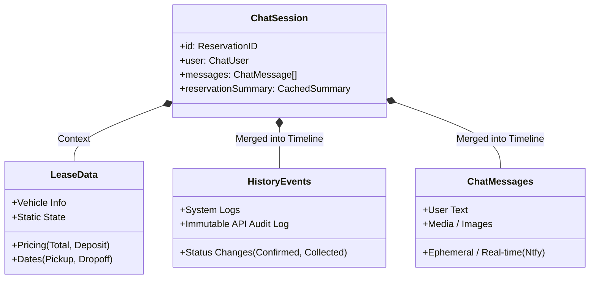
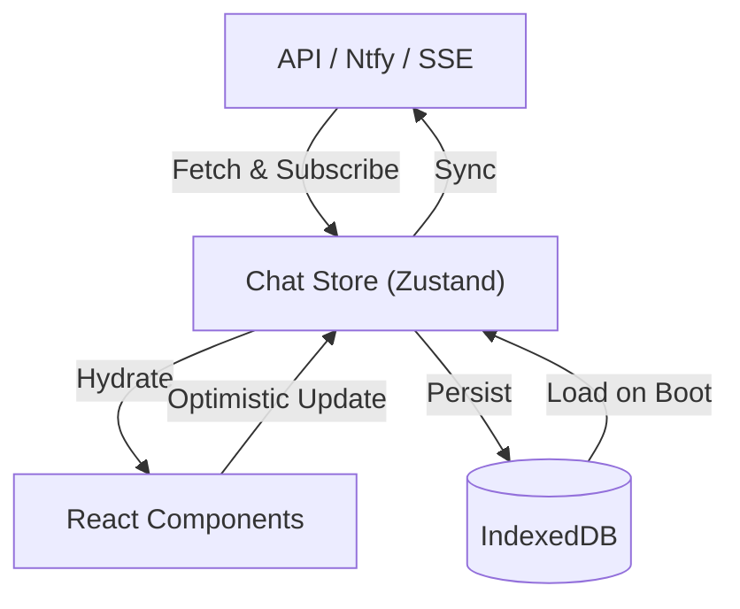
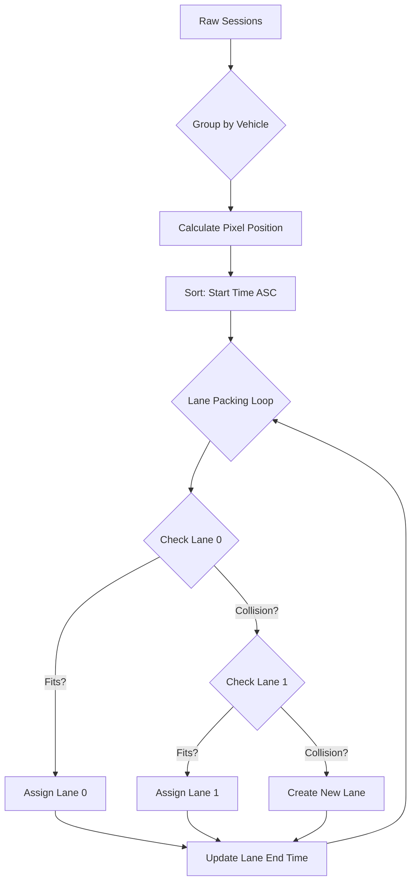

# 🏛️ Ownima Pro Architecture

This document outlines the high-level architecture, data patterns, and complex logic implementation of Ownima Pro.

## 🧠 Core Concepts

### 1. The Trinity of Data
The chat system is the heart of the application. It aggregates three distinct data sources into a single `ChatSession` object to provide a unified experience.

*   **LeaseData**: The "Source of Truth" for contract generation. Fetched via `loadLeaseData`.
*   **History**: Immutable events from the backend (e.g., "Reservation Created", "Payment Received").
*   **Messages**: Real-time communication via Ntfy.sh (JSON stream + SSE).

### 2. Data Flow & Sync Strategy
We use **Zustand** for state management and **IndexedDB** for offline persistence.

*   **Optimistic UI**: Messages appear instantly in the UI before confirmation from the server.
*   **Hydration**: On app launch, `dbService` loads all sessions from IndexedDB immediately.
*   **Live Sync**: An `EventSource` (SSE) connection listens for new messages on the active chat topic.

## 📅 Scheduler Architecture (The "Tetris" Packer)

The `SchedulePage` uses a custom layout algorithm to visualize bookings on a timeline. It solves the problem of overlapping bookings for the same vehicle (e.g., one ends at 10:00, another starts at 12:00) without visual collisions.

### The Algorithm (`useTimelineLayout`)

1.  **Normalization**: All dates are converted to absolute pixel offsets relative to a `timelineStart` date.
2.  **Grouping**: Sessions are grouped by `Vehicle Name + Plate`.
3.  **Packing**: For each vehicle group, we iterate through bookings sorted by start time and assign them to visual "lanes" (rows).

This ensures a compact, gap-less display similar to a Gantt chart or a spreadsheet freeze-pane view.

## 🤖 AI Integration (Gemini 2.5)

Phase 8 introduces Intelligence via `@google/genai`.

### Intent Analysis Loop
The system passively analyzes conversation history to suggest workflow actions.

1.  **Trigger**: New message received from "Other" (Renter).
2.  **Context Assembly**: 
    *   Current `LeaseStatus` (e.g., "confirmed").
    *   Last 10 messages transcript.
3.  **Prompting**: Gemini is asked: *"Given the status is 'confirmed' and the renter said 'I am here', what is the next action?"*
4.  **Output**: Structured JSON `{ action: "collect", reason: "Renter arrived" }`.
5.  **UI Feedback**: A "Sparkles" suggestion banner appears in the chat input area.

## 📂 File Structure Highlights

*   **`src/stores/chatStore.ts`**: The brain. Handles fetching, merging, AI analysis, and state logic.
*   **`src/services/ownimaApi.ts`**: The bridge. normalized API calls and mock data fallbacks.
*   **`src/components/chat/ChatWindow.tsx`**: The main view. Composes the MessageList, Header, and Input.
*   **`src/pages/SchedulePage.tsx`**: The visualization. Contains the Gantt logic.
